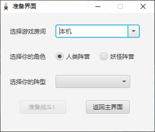
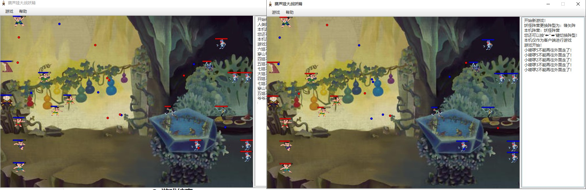
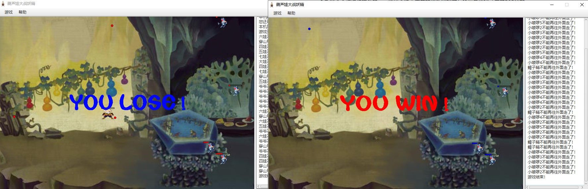
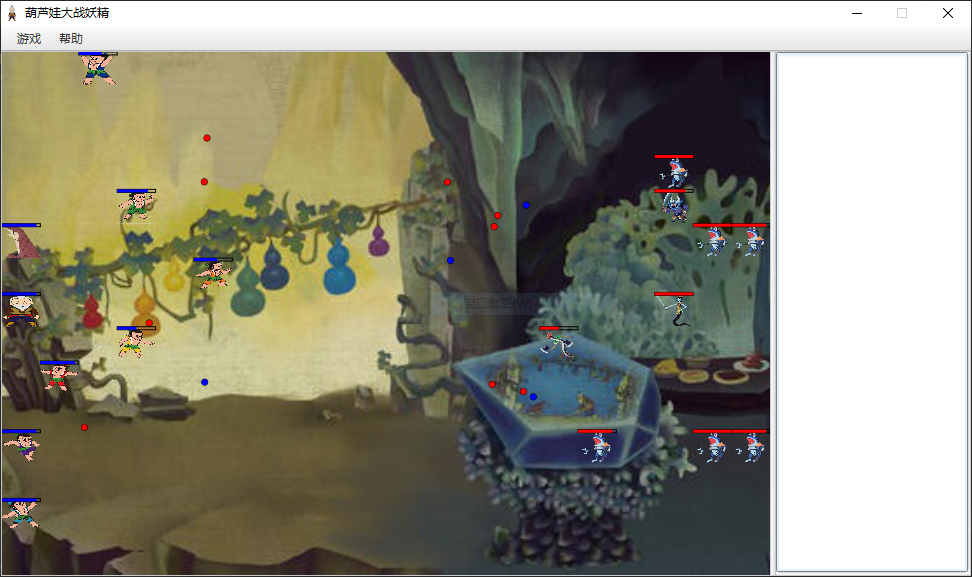

# 葫芦娃大战妖精游戏
## 一、游戏简介

葫芦娃大战妖精游戏是一个实时的PVP战斗游戏，您可以操控葫芦娃或者妖精阵营与小伙伴进行对战并获得最终胜利。

葫芦娃大战妖精游戏注重用户的交互体验，游戏开设房间借鉴《人类一败涂地》在本地开设服务器的模式，游戏模式借鉴《英雄联盟》、《风暴英雄》等的分阵营实时战斗模式，对游戏中不同生物操控逻辑借鉴《实况足球》、《FIFA》等的选人逻辑。同时，本游戏也加入了《英雄联盟》、《实况足球》等游戏提供的游戏回放功能，可以随时回看您和小伙伴的战斗录像。

## 二、设计思想

### 1. 目录结构

```shell
├─main
│  ├─java
│  │  └─nju
│  │      └─linhao
│  │          ├─ai
│  │          │  ├─attack
│  │          │  └─direction
│  │          ├─battlefield
│  │          ├─bullet
│  │          ├─controller
│  │          │  ├─logic
│  │          │  └─window
│  │          ├─creature
│  │          ├─enums
│  │          ├─exception
│  │          ├─io
│  │          ├─team
│  │          └─utils
│  └─resources
│      ├─css
│      ├─docs
│      ├─fxml
│      ├─icon
│      └─pictures
│          ├─bullets
│          └─creatures
└─test
    └─main
        └─java
            └─nju
                └─linhao
                    ├─controller
                    │  └─logic
                    └─creature
```

本项目目录结构如上所示，各目录对应包含的内容如下：

1. `ai`：实现没有被当前玩家控制的生物线程自动移动和攻击
   1. `attck`：选择攻击的敌方生物
   2. `direction`：选择当前生物的移动方向
2. `battlefield`：实现所有关于战场的信息储存和调度控制
3. `bullet`：实现子弹、子弹工厂、子弹管理者和回放中显示子弹
4. `controller`：实现本地游戏逻辑控制器、网络控制器、主窗口控制器和选择房间窗口控制器
   1. `logic`：实现本地游戏逻辑控制器和网络控制器
   2. `window`：实现主窗口控制器和选择房间窗口控制器
5. `creature`：实现所有生物，同时含有创建生物的工厂
6. `enums`：实现用到的所有枚举类型，包括阵营、网络信息类型、阵型等
7. `exception`：实现自定义的异常处理
8. `io`：实现与文件系统的交互相关内容，包括储存游戏记录和读取游戏记录
9. `team`：实现不同阵营队伍保存信息的相关内容，同时含有构建队伍的建造者
10. `utils`：实现不同的工具包，包括网络传输的信息、IP地址合法性判断者、图片加载器等

### 2. 设计原则

#### 2.1 SRP单一职责原则

每个类都只完成自己负责的部分，例如未被当前玩家控制的生物的自动攻击类只会选择敌方存活的单位进行攻击，而不会移动或者做其他事情。战场控制器`BattlefieldController`只负责控制战场的逻辑，而不会干涉别的控制器自己的行为。

#### 2.2 OCP开放封闭原则

针对抽象编程，例如生物类的基类`Creature`是一个抽象类，包含了各种抽象的方法，但同时继承生物的类可以覆写自己的方法。达到了面向修改封闭，面向拓展开放的效果。

#### 2.3 LSP里氏替换法则

子类继承父类有严格的限制，例如继承自`Creature`的不同类不会覆写`Creature`的非抽象方法。同时，我计划未来在基类`Creature`中实现不同生物技能的抽象接口，然后在各个子类中进行覆写。

#### 2.4 ISP接口隔离原则

所有的类和属性对外界都保持有所能做到的最小的访问接口，让外界对需要调用的方法进行组合。例如`NetworkController`里面对外界暴露的只有`sendMessage()`方法，所有需要和另一个客户端通信的请求都可以调用这个最小的访问接口，同时不能调用`NetworkController`中任何其它方法（除了设置关键的`NetworkController`信息）。

#### 2.5 DIP依赖倒置原则

高层的实现都依赖抽象的实现，例如需要依赖生物的类都依赖`Creature`，需要依赖子弹的类都依赖`Bullet`。

### 3. 设计模式：

#### 3.1 单例模式

引入单例模式，是因为以下这些类在一个应用程序的生命周期中仅可能存在一个实体；同时，因为引入饿汉式的单例模式，所以保证了多线程安全。

1. `LocalGameController`：

   ```java
   private static LocalGameController localGameController = new LocalGameController();
   
   private LocalGameController() {}
   
   public static LocalGameController getInstance() {
   	return localGameController;
   }
   ```

2. `Displayer`, `Recorder`, `Restorer`的实现类似`LocalGameController`的实现，不再赘述。

#### 3.2 工厂模式

引入工厂模式，是因为我们需要创建不同的生物和子弹。为了拓展性和易用性考虑，代码改写了原始工厂类的方法，我们可以直接向工厂类中调用`createXXX()`方法创建所需的对象，而不是像传统的工厂类那样写大量的if-else语句。

1. `CreatureFactory`：

   ```java
   public class CreatureFactory {
       private CreatureFactory(){}
   
       // for humans
       public static Grandpa createGrandpa(){
           return new Grandpa();
       }
   
       public static ArrayList<CalabashKid> createCalabashKids(){
           ArrayList<CalabashKid> calabashKids = new ArrayList<>();
           calabashKids.add(new CalabashKid(DEFAULT_CALABASH_KID_1_NAME));
           calabashKids.add(new CalabashKid(DEFAULT_CALABASH_KID_2_NAME));
           calabashKids.add(new CalabashKid(DEFAULT_CALABASH_KID_3_NAME));
           calabashKids.add(new CalabashKid(DEFAULT_CALABASH_KID_4_NAME));
           calabashKids.add(new CalabashKid(DEFAULT_CALABASH_KID_5_NAME));
           calabashKids.add(new CalabashKid(DEFAULT_CALABASH_KID_6_NAME));
           calabashKids.add(new CalabashKid(DEFAULT_CALABASH_KID_7_NAME));
           return calabashKids;
       }
   
       public static Pangolin createPangolin(){
           return new Pangolin();
       }
   
       // for monsters
       ...
   }
   ```

2. `BulletFactory`的实现类似，不再赘述。

#### 3.3 建造者模式

1. `TeamBuilder`：建造者模式使用多个简单的对象一步一步构建成一个复杂的对象。因为游戏需要区分不同的队伍，对于人类和妖精两个阵营都有复杂的队伍人员构成，因此可以用一个`TeamBuilder`类分别一步一步地创建两支队伍：

   ```java
   public class TeamBuilder {
       private TeamBuilder(){}
   
       public static HumanTeam buildHumanTeam(){
           Grandpa grandpa = CreatureFactory.createGrandpa();
           Pangolin pangolin = CreatureFactory.createPangolin();
           ArrayList<CalabashKid> calabashKids = CreatureFactory.createCalabashKids();
           return new HumanTeam(
                   grandpa,
                   pangolin,
                   calabashKids);
       }
   
       public static MonsterTeam buildMonsterTeam(int minionNum){
           ...
       }
   }
   ```

#### 3.4 中介者模式

因为所有类之间、不同的客户端之间都需要相互通信，这将大大加大通信复杂性，所以需要一个“中介者”充当中间角色，使各部分代码支持松耦合，易于维护。

1. `LocalGameController`：充当本地客户端不同类之间通信的中介者

2. `NetworkController`：充当不同机器上不同客户端之间通信的中介者

#### 3.5 MVC架构

虽然严格说来，MVC架构不算基本的设计模式，但本程序借鉴了MVC架构的设计思想，建立了战场控制器、战场和战场视图之间的MVC架构，让整体控制逻辑更清晰。

1. `BattlefieldController`, `Battlefield`, `MainWindowView`三个类构成MVC架构

## 三、实现细节

### 1. 机制应用

#### 1.1 面向对象编程

##### 1.1.1 封装

每个类都封装了自己的方法、属性。对对象的私有属性，均实现为`private`成员。整体工程实现上有用到`private`, `protected`和`public`三种关键字。

##### 1.1.2 继承

整体工程主要的继承是`Creature`和`Bullet`两个继承体系，他们的基类都是抽象类。此外还有不同的类实现了`Runnable`类的`run`接口，满足多线程运行程序。

##### 1.1.3 多态

某些函数提供多种参数，方便外界根据需要调用。例如`NetworkController`提供`sendMessage(MessageType messageType)`和`sendMessage(MessageType messageType, Object object)`两种方法，让外界调用的时候可以选择发送仅有`MessageType`的消息或除了`MessageType`以外还含有`MessageContent`的消息。

#### 1.2 异常处理

整体工程大量采用了Java语言自带的异常处理机制。例如`NetworkController`模块可以处理`IOException`, `ClassNotFoundException`和`InterruptedException`，`Restorer`模块可以处理`IOException`和`ClassNotFoundException`等。我还自己实现了自定义的Exception类型`OutofRangeException`，它的意义是对超出战场范围的错误抛出异常。

```java
public class OutofRangeException extends Exception {
    public OutofRangeException() {}

    public OutofRangeException(String msg) {
        super(msg);
    }
}
```

此外，由于代码中使用了`ReentrantLock`（例如对生物血量的锁、对不同记录时间间隔记录的锁等等），所以也使用了`try...finally`的方法防止其中抛出异常以后锁未及时释放。例如：

```java
this.healthLock.lock();
try {
	this.health -= (damage - defense);
} finally {
	this.healthLock.unlock();
}
```

#### 1.3 集合类型

工程主要采用`HashMap`, `LinkedList`和`ArrayList`三种集合类型。其中`HashMap`主要针对查询操作优化，如查询生物的图像等；`LinkedList`主要针对频繁增删的操作，如读取大量记录、存储各种子弹等；而`ArrayList`则主要针对需要固定保存信息的操作，例如保存所有人类、所有妖精，还有n个小喽啰等。

#### 1.4 泛型

工程同样采用了泛型机制，例如`Enums`类中利用泛型机制可以对枚举类型进行随机选择：

```java
public class Enums {
    private static Random rand = new Random(11);

    public static <T extends Enum<T>> T random(Class<T> enumClass) {
        return random(enumClass.getEnumConstants());
    }

    public static <T> T random(T[] values) {
        return values[rand.nextInt(values.length)];
    }
}
```

再如`Team`这一抽象基类中使用`<T extends Creature>`的泛型来保证进入队伍中的对象都至少是生物：

```java
public abstract class Team<T extends Creature> implements Serializable {
    protected Formation formation = Formation.LONG_SNAKE_FORMATION;
    protected ArrayList<T> teamMembers = new ArrayList<>();
	...

    public ArrayList<T> getTeamMemebers(){
        return teamMembers;
    }
}
```

而`HumanTeam`中则以`<T extends Human>`的泛型机制来避免妖精混入人类的队伍：

```java
public class HumanTeam<T extends Human> extends Team<Human>{
	...
}
```

`MonsterTeam`同`HumanTeam`，不再赘述。

#### 1.5 注解

工程中主要使用`@Override`注解标明需要覆写的父类方法：例如对继承`Runnable`接口的类，需要用

```java
@Override 
public void run(){...}
```

指明需要此线程运行时执行的内容；再如，针对某些需要他们`toString`方法的类，包括`Creature`，以及枚举类型中的`MessageType`, `Formation`等都有

```java
@Override
public String toString(){...}
```

方法指明如何返回这个类对应对象的字符串描述。

#### 1.6 网络通信

网络通信部分，本工程主要让加入他人房间的客户端使用`Socket`与服务器建立TCP连接，而创建房间的客户端则利用`ServerSocket`建立本地服务器的套接字。此外，对网络通信的内容，主要使用`ObjectInputStream`和`ObjectOutputStream`进行输送和接收。针对接收的内容，本工程采用`private void parseMessage(Message message)`进行处理，它可以针对各种封装的`Message`的`MessageType`进行相应的处理。

本工程同时针对网络通信进行了一致性的保证，避免两个客户端因为延迟而产生不一致的游戏状态或游戏结果。本内容将在稍后“1.9 一致性”部分进行介绍。

#### 1.7 输入输出

针对游戏记录文件的输入输出，本工程同样采用`ObjectInputStream`和`ObjectOutputStream`，分别包装`FileInputStream`和`FileOutputStream`进行记录。

注意此处有一个陷阱，就是如果将同一对象反复采用`ObjectOutputStream`进行输出，那么即使曾经修改过这个对象的属性，Java也只会在文件中将这个对象的记录数+1，而不是重新记录对象。这将导致如果我移动生物，记录将永远在保存生物移动的第一个位置，而不会进行后续移动。针对这一问题，我将所需要的关键信息组织成`String`类型，这样一定可以保证`ObjectOutputStream`会多次记录生物不同时刻的移动结果。

#### 1.8 多线程

多线程部分比较繁琐，我采用多种方法，能够保证线程安全性：

##### 1.8.1 饿汉式的单例模式

饿汉式的单例模式基于ClassLoader机制避免了多线程的同步问题，这一实现体现在`LocalGameController`, `Displayer`, `Recorder`和`Restorer`中，上面已经进行详述，这里略去。

##### 1.8.2 方法的synchronized

针对可能并发执行临界区的方法，例如`Battlefield`中更新全局棋盘中各位置是否有生物的`updateCreatureGrids`方法、调用绘制函数重绘全局画布的`repaint`函数可能会在多线程环境中并发执行临界区，所以我将这些方法加上`synchronized`关键字避免并发不安全。

##### 1.8.3 变量的synchronized

针对某些可能并发访问的变量，例如子弹管理者`BulletManager`中的`addBullet`和`removeBullet`方法，我根据不同情况分别对`humanBullets`和`monsterBullets`加上`synchronized`关键字，避免并发访问`LinkedList`的线程不安全问题。

##### 1.8.4 ReentrantLock

针对某些需要更细粒度锁，更灵活控制的变量，我采用`ReentrantLock`对他们加锁控制并发访问。例如我对每个生物都实现了`healthLock`，防止某个生物同时被多个子弹打中时并发扣去该生物的血量，导致剩余血量错误的情况发生；我也针对战斗记录中的“距离上一次写记录的时间”，即`timeMilliseconds`这一变量实现了`timeMillisecondsLock`，防止并发写记录时对`timeMilliseconds`的修改产生错误的结果。

#### 1.9 一致性

因为自己对分布式系统没有了解，所以本工程采用的是我认为简单又实用的协议。

##### 1.9.1 服务器与客户端确认

在准备游戏阶段，每个客户端或者需要创建房间，或者需要加入房间。

如果要加入他人创建的房间，默认自己是客户端即可。采用的共识协议是服务器一定会先创建好房间等待客户端加入，如果有客户端要加入，向服务器发送我自定义的CLIENT_READY数据包，等待服务器回送SERVER_ACK数据包，建立连接。

但要加入的房间如果是本地，怎么知道这个IP地址是否已经有其它客户端开好了房间？我采用的协议是：先声明自己是服务器，然后在这个IP地址上的固定端口创建ServerSocket，如果已经有人创建，那么catch异常，将自己修改为客户端。

##### 1.9.2 连接建立

连接建立也有一个微妙的问题，就是如果两边客户端都选择了同一阵营，应该如何处理？我的解决方案是：因为服务器是先创建房间的，那么服务器仍然遵循自己选择的阵营，而客户端向服务器发送创建阵营的数据包会被服务器处理，将错误返回客户端，让客户端选择另一个阵营。作为对客户端的惩罚，程序将选择最初级的“长蛇阵”作为开始阵型。

以下是`NetworkController`建立连接的核心逻辑：

```java
@Override
public void run() {
	// 首先，如果连接的是本机，那么自己就是服务器
	if (destIp == localIp || destIp == "127.0.0.1") {
		isCurrentClientServer = true;
		try (ServerSocket serverSocket = new ServerSocket(Configuration.DEFAULT_PORT)){

		} catch (IOException e){
			isCurrentClientServer = false;
		}
	}
	if(isCurrentClientServer == false) {
	// 其次，如果连接远程，默认对方是服务器，且该房间要存在
		try {
			while (true) {
				socketToServer = new Socket(destIp, destPort);//请求对方是不是服务器
				sendMessage(MessageType.CLIENT_READY);
				Message recvMsg = recvMessage();
				parseMessage(recvMsg);
				if (connectionEstablished) {
					isCurrentClientServer = false;
					LocalGameController.getInstance().requestLogMessages("本机仅作为客户端进行游戏");
					break;
				}
			}
		} catch (IOException | ClassNotFoundException e) {
			System.err.println("对方房间不存在！");
			LocalGameController.getInstance().requestLogMessages("想要连接的房间不存在！");
		}
	}
    // 对各种信息进行处理
    try {
        if(isCurrentClientServer) {
        	serveAsServer();//让本机作为服务器初始化
        }
        while (true) {
            Message recvMsg = recvMessage();
            parseMessage(recvMsg);
        }
    } catch (IOException | ClassNotFoundException | InterruptedException e) {
    	e.printStackTrace();
    }
}
```

##### 1.9.3 游戏状态同步

游戏状态同步是最复杂的部分。因为网络延迟、执行延迟等因素，各个客户端在不同时刻处于不同状态。在实时对战游戏中可能会导致不同的客户端上死亡的生物、存活生物的剩余血量等都不正确。针对这个问题我采用最简单的分布式协议：某个客户端本地确实发生的事情，其它客户端都会决定该值。我设计了CREATURE_INJURED和BULLET_DESTROY两个MessageType，如果本地客户端运行的生物线程被伤害，那么立即通知另一个客户端减少这个生物对应的血量，让子弹消失。另一个客户端无论如何立即让这个生物受到伤害，子弹消失并保存游戏记录。这样就保证了分布式中的一致性准则。

## 四、测试

### 1. 单元测试

#### 1.1 状态机单元测试

游戏的核心逻辑是`LocalGameController`中对游戏状态的维护，包括INIT, CONNECTING, READY, RUN, WE_LOSE, WE_WIN, END共7个状态。因此保证游戏状态的正确性对游戏的执行至关重要。我针对它设计了单元测试，穷尽所有状态转换，查看状态机是否能接收、处理正确的转换。

```java
@Test
public void setCurrentStatus() {//状态机的测试
    boolean[][] statusTransitionGraph = new boolean[7][7];
    statusTransitionGraph[0][0]=true;
    statusTransitionGraph[0][1]=true;
    statusTransitionGraph[1][0]=true;
    statusTransitionGraph[1][2]=true;
    statusTransitionGraph[2][3]=true;
    statusTransitionGraph[3][4]=true;
    statusTransitionGraph[3][5]=true;
    statusTransitionGraph[4][6]=true;
    statusTransitionGraph[5][6]=true;
    statusTransitionGraph[6][0]=true;
    LocalGameStatus[] localGameStatuses = LocalGameStatus.values();
    int localGameStatusLen = localGameStatuses.length;
    int cnt = 0;
    for(int i = 0; i < localGameStatusLen; ++i) {
    	LocalGameController.getInstance().setCurrentStatusWithoutCondition(localGameStatuses[i]);
    	for(int j = 0; j < localGameStatusLen; ++j) {
    		if(statusTransitionGraph[i][j] == false){
    			LocalGameController.getInstance().setCurrentStatus(localGameStatuses[j]);
    			assertTrue(LocalGameController.getInstance().getCurrentStatus() == localGameStatuses[i]);
    			System.out.println("Test " + localGameStatuses[i] + " to " + localGameStatuses[j] + ": Successful");
    		}
    	}
    }
    return;
}
```

#### 1.2 生物血量并发压力测试

生物血量是很重要的用户体验。而在并发环境中生物可能被多个子弹打到，造成剩余血量不正确的结果。针对这个潜在的问题，我设计了并发压力测试。测试的主要逻辑是先利用barrier卡住各个线程，然后并发调用50次生物的`injured()`方法对它造成伤害，最后计算生物的剩余血量与预期的是否一致。

```java
public class CreatureTest {
    private Random random = new Random(47);

    @Test
    public void injured() {
        Creature creature = new Human(true, "测试生物", 250, 10, 1, 10);
        int testThreadCnt = 50;
        CyclicBarrier cyclicBarrier = new CyclicBarrier(testThreadCnt + 1 );
        int randDamage =  random.nextInt(10);
        for(int i = 0; i < testThreadCnt; ++i){
            Thread thread = new Thread(new Task(cyclicBarrier, creature, randDamage));
            thread.start();
        }
        try {
            cyclicBarrier.await();
            cyclicBarrier.await();
        } catch (Exception e){
            e.printStackTrace();
        }
        System.out.println("Rest Health: " + creature.getHealth());
        assertTrue((creature.getHealth() == 250 - (randDamage - 1) * 50)
                && creature.getCreatureStatus() == CreatureStatus.DEAD);
    }

    private class Task implements Runnable{
        private CyclicBarrier cyclicBarrier;
        private Creature creature;
        private int randomDamage;

        public Task(CyclicBarrier cyclicBarrier, Creature creature, int randomDamage) {
            this.cyclicBarrier = cyclicBarrier;
            this.creature = creature;
            this.randomDamage = randomDamage;
        }

        @Override
        public void run() {
            try{
                cyclicBarrier.await();
                this.creature.injured(this.randomDamage);
                cyclicBarrier.await();
            } catch(Exception e){
                System.out.println("Time Limit Exceeds");
                e.printStackTrace();
            }
        }
    }
}
```

### 2. GUI测试

除了单元测试，GUI测试也必不可少。我和同学进行了多场对战和回放，在我们的测试中程序都通过了GUI测试。

## 五、奇思妙想

这部分是我自己在写大作业过程中的心路历程和各种想法。

### 1. 用户交互设计

#### 1.1 创建与加入房间

在网络对战游戏中，创建房间是一个很重要的过程。我为此特地咨询了许多没有接触过编程的同学，综合了他们的意见，我需要做到

1. 文字清晰
2. 尽量没有晦涩的网络地址（IP地址）
3. 除了游戏客户端，不要有多余的程序要打开

这三点。根据前两点，我选用了类似《人类一败涂地》的创建房间方式：如果你要创建自己的房间，直接选择阵营开始即可；如果你要加入别人的房间，一定要输入对方的地址才行。对于第三点，这涉及到网络架构的设计，将在2. 网络架构设计中探讨。

#### 1.2 战斗逻辑与操控体验

在战斗逻辑部分，我借鉴了《英雄联盟》的分阵营战斗模式，《CS》中取消友军伤害的设定。开始游戏前，玩家仍然可以调整阵型，但不能提前看到对方准备采用的阵型：这保证了公平性。开始游戏后，可以点击对方生物就可以直接对他发射子弹进行攻击，也可以操控自己的生物移动躲避敌方的子弹并选择更好的战斗位置。在结束游戏的时候，屏幕上会显示YOU WIN!或YOU LOSE!字样，做到用户友好。

### 2. 网络架构设计

网络架构部分，我曾经考虑过C/S，B/S和P2P三种架构。之前也着手实现了一半的C/S架构。但是考虑到之前为了用户体验设计的第三点“除了游戏客户端，不要有多余的程序要打开”，用户并不希望除了游戏客户端以外还要打开一个黑乎乎的命令行运行服务器——这样会没人愿意玩这款游戏了！所以最终我才用了P2P的架构，实现对称的客户端和网络通信结构。我认为这一切都是为了用户考虑，这么做也是值得的。

### 3. 并发算法设计

并发算法设计在“三、实现细节”的“1.8 多线程”部分已经谈了很多，但是这里我还想谈谈关于`ReentrantLock`的部分。原来我打算实现的是全部采用`synchronized`方法，我也在网上搜到`synchronized`现在的优化可以做到类似锁的性能。但是为什么我还是要用`ReentrantLock`呢？因为我想挑战自己（笑），感觉使用锁一定要是一个合格的程序员敢做的事情。

### 4. 一致性设计

因为网络通信的缘故，分布式算法中的一致性变得非常重要。不遵守一致性的规定可能导致各种奇怪的bug。虽然我也没学过此类一致性算法，但我自己提出了自己的简单的一致性协议：本地决定的，所有其他人都按照本地决定的做。我认为这是一件很有意义的事情，值得记录。

除此之外，服务器与客户端的角色确认也是我自己苦思冥想的结果，这两者的协调非常微妙，体现了计算机网络的博大的设计思想在这次网络通信设计中的应用，我认为这也是一件值得记录的事情。

具体的算法在“三、实现细节”的“1.9 一致性”部分做了记录，此处不再赘述。

## 六、运行示例

### 1. 游戏界面


### 2. 游戏准备



### 3. 游戏开始



### 4. 游戏结束



### 5. 战斗回放



## 七、未来开发计划

- 菜单栏：
  - 将战斗记录文件“另存为”到别的地址
  - 加入“帮助”文档
- 游戏准备：
  - 加入密码房间功能保护私密性
  - 加入更多的生物阵型，支持自定义阵型
- 游戏进行：
  - 可以按'Q', 'E'键左右切换操控的生物，也可以按1~9的数字键快速切换到想要操控的生物
  - 每个生物有不同的技能、属性，例如老爷爷可以给葫芦娃恢复血量，某些葫芦娃防御力更高而攻击力更低
  - 引入等级机制，让生物在游戏过程中获取经验升级进化技能，技能可以按不同的按键施放
- 战斗回放：
  - 可以提供倍速和拖放进度条功能等
- 核心逻辑：
  - 重构代码，使之更易读、维护
  - 引入更好的一致性协议
  - 让并发粒度更细，优化游戏表现
- 等

## 八、心得体会

1. 并发程序设计可能存在很多并发错误，需要谨慎考虑可能的情况，管理临界区和临界变量。
2. 网络通信的同步涉及到很多知识盲区，需要自己未来更加努力，学会这些知识，做到学以致用。
3. 设计一个软件/游戏非常需要注重用户体验，如果没有良好的用户体验，即使软件设计得再优秀也不会有人使用 
4. 设计模式对开发大型复杂软件系统也很重要，如果不采用合适的设计模式和设计理念，可能会让设计过程变得非常繁琐，后续迭代开发也变得越来越困难。
5. 整体程序的架构设计也很重要，从C/S，B/S到P2P架构，我和不同的同学进行过很长时间的探讨。在这个过程中，我对不同的架构在不同场景下的应用也有更深的感受。

## 九、作者

- Name: Lin Hao
- Correspondence: 1184264181@qq.com